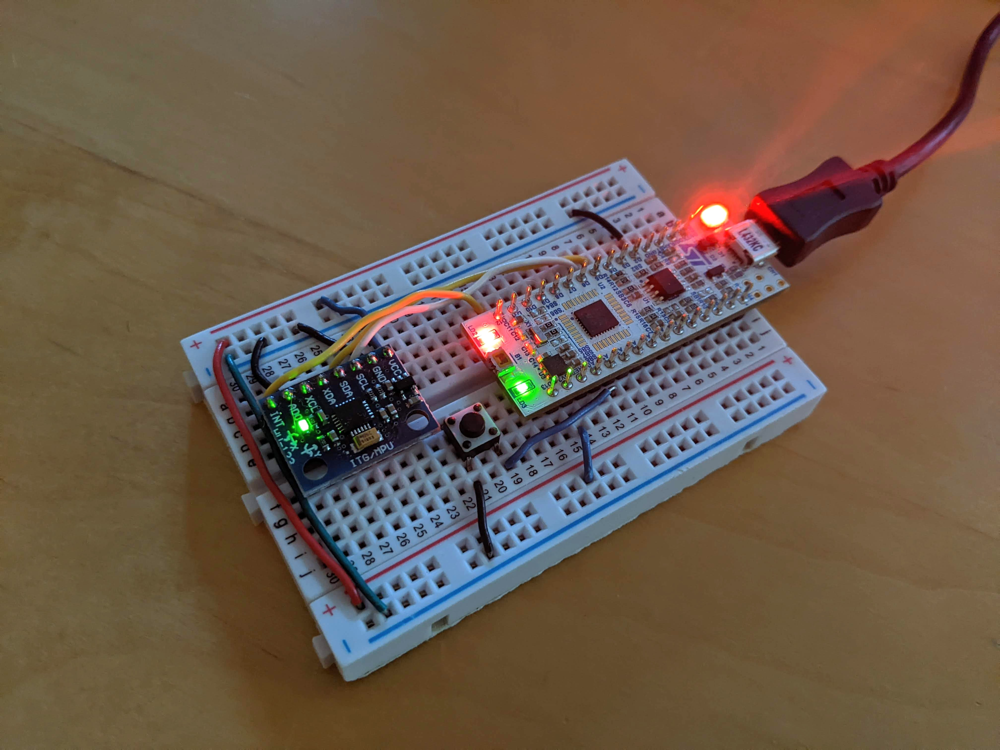

# Sensor Fusion with MPU6050 targeted for STM32 Nucleo-L432KC board

- Targets Nucleo-L432KC board for smaller form-factor and automatic USB re-enumeration with ST-LINK/V2-1
- Sensor fusion algorithm (complementary filter) estimates roll and pitch angles of MPU6050 IMU
- Implements a MPU6050 low-level C driver using I2C and DMA for efficient data acquisition
- Calibration branch used for conveniently recording averages of datapoints to calibrate IMU readings before feeding into filter

